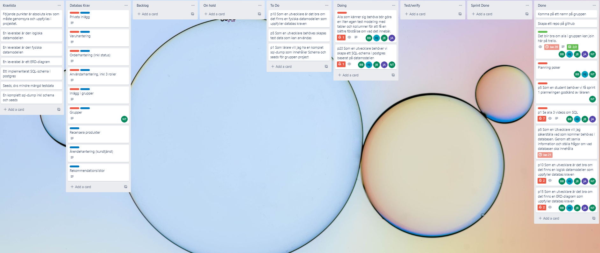

# u04a-PiedPiper-agile 

Table of contents  

- [u04a-PiedPiper-agile](#u04a-piedpiper-agile)
  - [Purpose](#purpose)
  - [piedpiper](#piedpiper)
  - [Docmentation](#docmentation)
  - [Agile methods](#agile-methods)
    - [Workflow](#workflow)
  - [SQL modelling](#sql-modelling)
  - [SQL dumps](#sql-dumps)

___

This repo is for PiedPiper group assignment u04a-sql-scrum.  
  
The goal of this assignment is to design and implement a SQL database in Postgres.  
In the design phase we've created a logical model and a physical model to visualise entities, attributes, relationships and constraints.  
To implement the SQL schema we've used psql (CLI) and pgadmin (GUI).  
A big part of this assignment was to learn, understand and use agile metod to manage workflows.  

## Purpose  

The database is going to be used by an app which has two main functions - a socal media part where users can connect to others directly via private messaging or through user-generated groups or post that all can read. The other part of the app is a webbshop where users can buy products.

## piedpiper 

Participators this assignment:  
-Nicklas Thor\
-Bernard Bruna\
-Jens Bejerskog\
-Hassan Jawdat\
-Johnny Agosile

___

## Docmentation  

Here is our documention than include aktivite log, sprint planning, retospectiv meeting log, and document about dialog with PO 

[Here is our documention](u04a_Agile-DB_DOE21_Chas_Academy_Grupp_PiedPiper.pdf).

___

## Agile methods  

A big part of this assignment was to get to know and use Scrum as a method for Agile development. We have used scrum and kanban board. 

As part of scrum we have had daily meeting most days, where everyone talk about what they previously done, what they plan to do and any hindrance or problem that they may have. 

We have had sprint planning meetings where we decide what we plan to do during the next sprint.

We have had retrospective meeting where we check what have been good and bad, as well as document where we wrote down importent observations and changes we wish to try out.

We have had review meeting to check what has been done in a way the group think is good.

___

### Workflow  

We used Trello for managing our kanban board.  
  
&rarr; [Trello board](https://trello.com/b/QheWWuGd/teamprojekt1)  

___

## SQL modelling  

For our logical and physical models we talked with in our group and decided what to have in the database. We documented alot during this assignment and wrote it all down. We have also checked with PO about several thinks to make it avoid missunderstandings and make it more clear that needed. We used both writings in document, whimsical and PGadmin to create these models.
  

|[whimsical.com ERD](whimsical_ERD.PNG)|[PGadmin ERD](PGadmin_ERD.PNG)|
|---|---|

___

## SQL dumps  

Database dumps are located [Here](Schema_piedpiper_backup_v2.sql).

